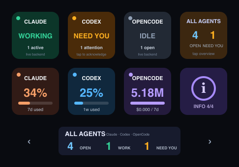

# Neo Agent Deck

[](https://github.com/OWNER/neo-agent-deck/actions/workflows/ci.yml)

Neo Agent Deck turns an Elgato Stream Deck Neo into a live physical console for Claude Code, Codex, and OpenCode. It uses the Neo's eight LCD keys, 248×58 InfoBar, and both touch points directly through USB HID—no cloud service and no API keys stored by the app.



## Layout

```text
┌────────────┬────────────┬────────────┬────────────┐
│ Claude     │ Codex      │ OpenCode   │ All Agents │
│ status     │ status     │ status     │ summary    │
├────────────┼────────────┼────────────┼────────────┤
│ Claude     │ Codex      │ OpenCode   │     ⓘ      │
│ usage      │ usage      │ usage      │ InfoBar    │
└────────────┴────────────┴────────────┴────────────┘
       ◀ touch       248×58 InfoBar       touch ▶
```

The bottom-right info key and right touch point cycle the InfoBar:

1. Claude 5-hour and weekly usage
2. Codex rate-limit usage
3. OpenCode 24-hour and 7-day token usage
4. Total open, working, and attention-needed sessions

The resting screen is All Agents, so the next four info-key presses show Claude, Codex, OpenCode, then All Agents. The left touch point cycles backward. Status colors are green for working, gray for idle, and amber when a completed/aborted turn needs attention. Tap an amber provider key to acknowledge all completed sessions for that provider.

## Data sources

- Claude status comes from live Claude Code session files; plan usage comes from Anthropic's usage endpoint with the existing Claude Code Keychain sign-in.
- Codex status and rate limits come from the structured lifecycle and rate-limit events Codex writes under `CODEX_HOME` (normally `~/.codex`).
- OpenCode status, tokens, and cost come from its local SQLite database. Usage is calculated from assistant messages for the last 24 hours and seven days.
- Historical idle sessions are not counted as open. The first provider row is aggregated, so a provider shows `NEED YOU` if any new completion is still unacknowledged.

## Why direct HID?

Elgato's public plugin SDK does not expose the Neo InfoBar or touch points to third-party plugins. Neo Agent Deck uses Elgato's [documented Neo HID protocol](https://docs.elgato.com/streamdeck/hid/stream-deck-neo/) and the MIT-licensed [Node Stream Deck library](https://github.com/Julusian/node-elgato-stream-deck) instead. Because one process must own the device, the Elgato Stream Deck app must be closed while Neo Agent Deck runs.

## Configuration

The per-key layout is configurable. Run the interactive setup to generate or edit your layout:

```bash
npm run setup
```

See [docs/SETUP.md](docs/SETUP.md) for the full configuration reference.

## Development

Requirements: macOS, Node.js 20.12+, and whichever of Claude Code, Codex, or OpenCode you want to monitor. The Neo can remain disconnected during development; the service waits quietly and reconnects automatically.

```bash
npm install
npm run doctor
npm run status
npm run preview:live
npm run dev
```

Run checks:

```bash
npm run check
```

Install as a macOS login service:

```bash
npm run install:mac
```

The installer does not ask for an administrator password. It installs only for the current user and starts automatically at login. If the Neo is unplugged, the process remains idle instead of repeatedly crashing. Logs are written to `~/Library/Logs/NeoAgentDeck.log` and `~/Library/Logs/NeoAgentDeck.error.log`.

To remove the background service and return the device to Elgato's app:

```bash
npm run uninstall:mac
open -a "Elgato Stream Deck"
```

## Troubleshooting

- If the keys show Elgato's normal profile, quit the Elgato Stream Deck app; it and Neo Agent Deck cannot own the USB device simultaneously.
- Run `npm run doctor` to check the Neo connection and all three backend data sources.
- Run `npm run status` to print the sanitized live state and usage values without requiring the Neo.
- Restart the installed service with `launchctl kickstart -k gui/$UID/com.neo-agent-deck`.

## Privacy

- Claude usage is fetched from Anthropic's usage endpoint with the existing Claude Code OAuth token read from macOS Keychain. The token is never written by Neo Agent Deck.
- Codex usage and state are read from local session files.
- OpenCode usage and state are read from its local SQLite database; prompts and message text are never read or displayed.
- No telemetry is collected.

## License

MIT. Stream Deck is a trademark of Elgato/Corsair. This project is independent and is not endorsed by Elgato, Anthropic, or OpenAI.
