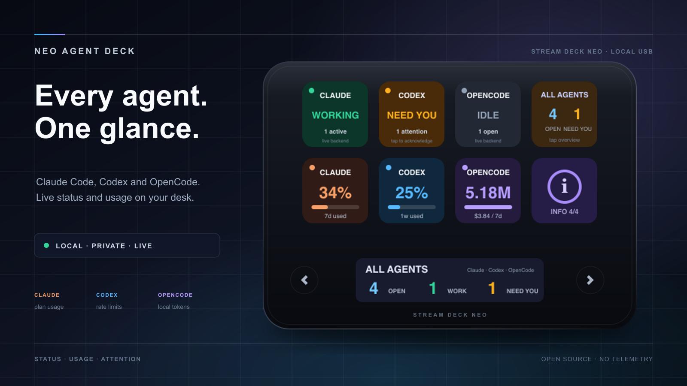
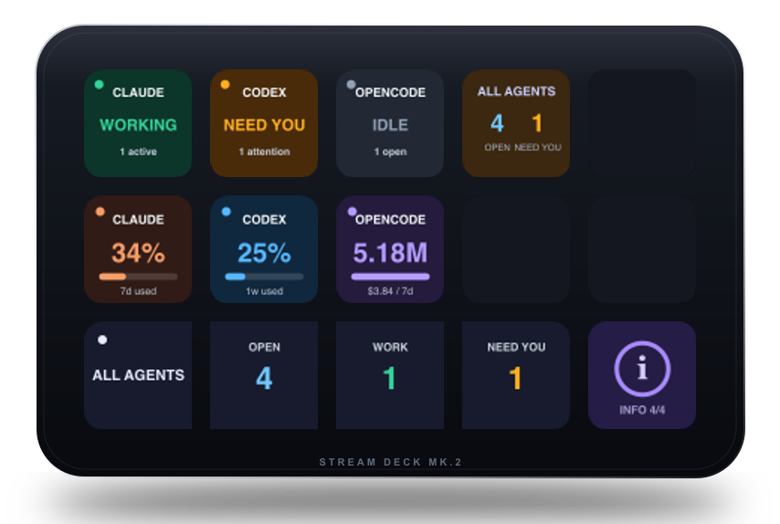
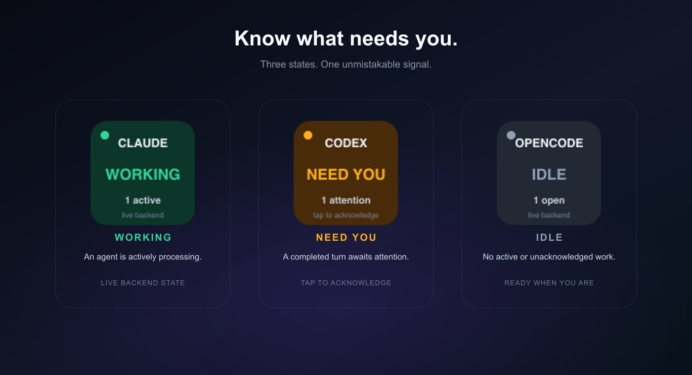
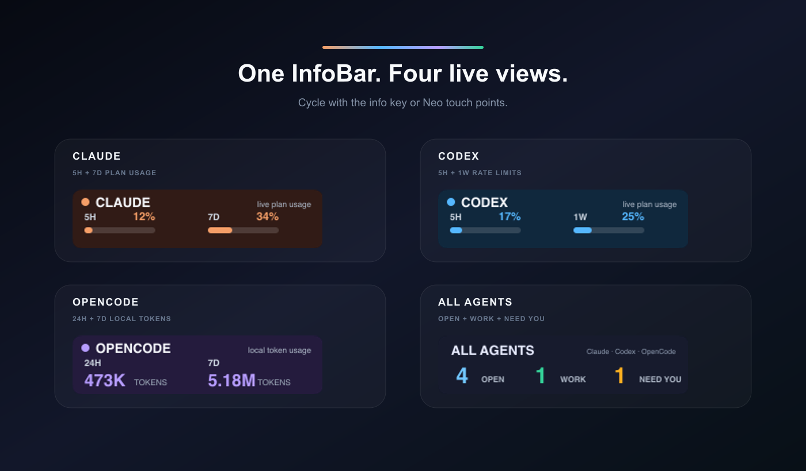
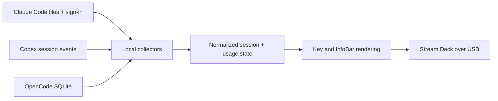

<p align="center">
  
</p>

<h1 align="center">Neo Agent Deck</h1>

<p align="center">
  A private, glanceable agent console for the Elgato Stream Deck.<br>
  See Claude Code, Codex, and OpenCode status and usage directly on your desk.
</p>

<p align="center">
  <a href="https://github.com/m-a-b-u/neo-agent-deck/actions/workflows/ci.yml"></a>
  <a href="https://github.com/m-a-b-u/neo-agent-deck/releases/latest"></a>
  <a href="LICENSE"></a>
  
  
</p>

Neo Agent Deck turns the Neo's eight LCD keys, 248×58 InfoBar, and two touch points into one dashboard. It runs locally over USB, reconnects automatically, and safely waits when the device is unplugged.

## Supported devices

The dashboard reads the key count, key resolution, and LCD segment from the connected device, so it adapts instead of assuming a Neo.

| Device | Layout | InfoBar |
| --- | --- | --- |
| Stream Deck Neo | 8 keys at 96×96 | 248×58 LCD segment, touch points page through it |
| Stream Deck MK.2, MK.2 Scissor, Original, Original V2 | 15 keys at 72×72 | Four keys of the bottom row, tap any of them to page |
| Stream Deck XL, 32 Module | 32 keys at 96×96 | Generated layout; assign `infobar` keys in `config.json` |
| Stream Deck Mini, 6 Module | 6 keys at 80×80 | Generated layout; assign `infobar` keys in `config.json` |

Decks without an LCD segment render the InfoBar across a run of adjacent keys — each key carries one block of the current page, and tapping any of them advances the rotation. Devices without drawable keys, such as the Pedal, are skipped.

<p align="center">
  
</p>

## Install in three steps

Requirements: Git, [Node.js 22.13+ on Node 22 or Node.js 24+](https://nodejs.org/), and macOS, Windows 10+, or Linux with a systemd user session. Node 23 is unsupported. The deck can stay unplugged during setup.

1. Clone the repository.

   ```bash
   git clone https://github.com/m-a-b-u/neo-agent-deck.git
   ```

2. Enter the project.

   ```bash
   cd neo-agent-deck
   ```

3. Start the guided installer.

   macOS / Linux:

   ```bash
   ./install.sh
   ```

   Windows PowerShell:

   ```powershell
   .\install.cmd
   ```

The terminal UI asks which deck the config is for, then shows its recommended layout. Press Enter to accept it, or choose `y` to customize every key, InfoBar page, resting page, and brightness. The installer then builds a private per-user copy and enables automatic startup.

macOS and Windows need no administrator password. Linux asks for `sudo` only if HID runtime packages or its Stream Deck USB permission rule are missing; the application and service still run as your user.

Sign in to at least one supported agent locally. Providers that are not installed or signed in remain safely unavailable without blocking the others.

## The default dashboard

```text
┌────────────┬────────────┬────────────┬────────────┐
│ Claude     │ Codex      │ OpenCode   │ All Agents │
│ status     │ status     │ status     │ summary    │
├────────────┼────────────┼────────────┼────────────┤
│ Claude     │ Codex      │ OpenCode   │     ⓘ      │
│ usage      │ usage      │ usage      │ InfoBar    │
└────────────┴────────────┴────────────┴────────────┘
        ◀ touch       248×58 InfoBar       touch ▶
```

| State | Meaning | Signal |
| --- | --- | --- |
| **WORKING** | At least one session is processing | Green |
| **IDLE** | No active or unacknowledged session | Gray |
| **NEED YOU** | A turn completed, stopped, errored, or needs input | Amber |

<p align="center">
  
</p>

Tap an amber provider key to acknowledge completed sessions. Tap **All Agents** for the combined view. The info key and right touch point move forward through the InfoBar pages; the left touch point moves backward. On a deck without touch points, the info key and every InfoBar tile move forward.

<p align="center">
  
</p>

The four pages show Claude's 5-hour and 7-day plan usage, Codex rate-limit windows, OpenCode local token totals, and combined session counts. If a refresh fails, retained values are marked **stale** instead of appearing live.

## Data sources and privacy

| Provider | Status and usage source | Network used by Neo Agent Deck |
| --- | --- | --- |
| Claude Code | Local session files; existing OAuth sign-in from macOS Keychain, the Claude credentials file, or `CLAUDE_CODE_OAUTH_TOKEN` | Anthropic usage request only |
| Codex | Lifecycle and rate-limit events in local Codex session files | None |
| OpenCode | Latest message plus aggregate token/cost fields in the local SQLite database | None |

Neo Agent Deck has no telemetry, hosted backend, or account system. It does not persist OAuth tokens or session content. Only lifecycle, timestamps, usage, and aggregate values affect the display. OpenCode uses Node's built-in read-only SQLite support; no separate `sqlite3` program is required.

Default data locations are home-relative on every platform:

| Provider | Default | Override |
| --- | --- | --- |
| Claude Code | `~/.claude` | `CLAUDE_CONFIG_DIR` |
| Codex | `~/.codex` | `CODEX_HOME` |
| OpenCode | `~/.local/share/opencode` | `OPENCODE_DATA_HOME` |

For the simplest Windows experience, run the agents natively on Windows. If their data lives in WSL, point the overrides at the corresponding `\\wsl.localhost\DISTRO\...` directories before installing the login service. See the [setup guide](docs/SETUP.md#windows-and-wsl) for an example.

## Configuration

The guided installer opens this setup automatically. To change keys, InfoBar rotation, resting page, or brightness later, run:

```bash
npm run setup
```

Configuration and acknowledgement state live in `~/.neo-agent-deck`. See the [setup guide](docs/SETUP.md) for every module and example layouts.

Useful non-interactive commands:

```bash
npm run setup -- --print    # show effective configuration
npm run setup -- --default  # restore the default layout
npm run setup -- --keys=15  # target a 15-key deck non-interactively
npm run status              # sanitized live backend summary; no deck needed
npm run doctor              # platform, device, sign-in, files, DB, backends
npm run preview:live        # render live data and print the image path
```

## How it works



The app polls local agent state every three seconds. Claude plan usage is cached for five minutes unless you tap a usage key. Device disconnects, malformed session lines, missing backends, and temporary collector failures are isolated so the service keeps running and reconnects.

Direct USB access is intentional: Neo Agent Deck uses the HID implementation from the MIT-licensed `@elgato-stream-deck/node` library, and reads each device's control layout from it.

## Troubleshooting

- **Elgato's normal profile is visible:** fully quit Elgato Stream Deck, then restart Neo Agent Deck.
- **A backend is unavailable:** run `npm run doctor`, then `npm run status` for the sanitized error.
- **The deck is unplugged:** the service waits and reconnects automatically.
- **macOS restart:** `launchctl kickstart -k gui/$UID/com.neo-agent-deck`.
- **Windows restart:** run `npm run install:win` again; it replaces and restarts the per-user service.
- **Linux restart:** `systemctl --user restart neo-agent-deck.service`.
- **macOS logs:** `~/Library/Logs/NeoAgentDeck.log` and `NeoAgentDeck.error.log`.
- **Windows logs:** `~/.neo-agent-deck/logs/NeoAgentDeck.log` and `NeoAgentDeck.error.log`.
- **Linux logs:** `journalctl --user -u neo-agent-deck.service -f`.
- **Linux USB permission denied:** re-run `npm run install:linux`, then unplug and reconnect the deck once.

To uninstall and return control to Elgato:

```bash
# macOS
npm run uninstall:mac
open -a "Elgato Stream Deck"
```

```powershell
# Windows
npm run uninstall:win
Start-Process "$env:ProgramFiles\Elgato\StreamDeck\StreamDeck.exe"
```

```bash
# Linux
npm run uninstall:linux
```

Preferences and logs are kept so reinstalling does not discard your layout.

## Development

```bash
npm ci
npm run doctor        # sanitized device and backend checks
npm run preview:live  # render current backend data without a deck
npm run preview:15key # render the 15-key layout from sample data
npm run dev           # run in the foreground
npm run check          # build, test typecheck, and unit/integration tests
npm run preview:docs   # regenerate all README product images
```

On macOS or Windows, close Elgato Stream Deck before `npm run dev`; only one process can own the USB interface. CI checks macOS, Windows, and Linux with Node.js 22 and 24. Tagged releases are published only after the same cross-platform matrix and service-installer smoke tests pass.

## License

[MIT](LICENSE) © Manuel Burgschachner. Stream Deck is a trademark of Elgato/Corsair. Claude, Codex, and OpenCode belong to their respective owners. This independent project is not endorsed by Elgato, Anthropic, OpenAI, or the OpenCode maintainers.
