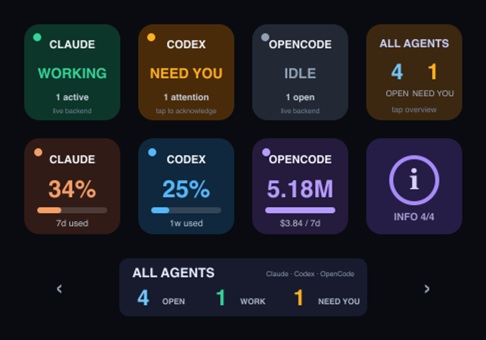
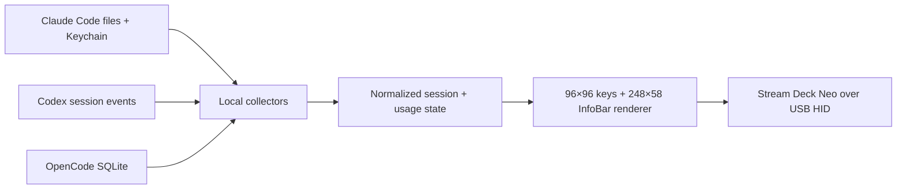

<p align="center">
  
</p>

<h1 align="center">Neo Agent Deck</h1>

<p align="center">
  A live, glanceable agent console for the Elgato Stream Deck Neo.<br>
  Claude Code, Codex, and OpenCode status and usage — directly on your desk.
</p>

<p align="center">
  <a href="https://github.com/m-a-b-u/neo-agent-deck/actions/workflows/ci.yml"></a>
  <a href="https://github.com/m-a-b-u/neo-agent-deck/releases/latest"></a>
  <a href="LICENSE"></a>
  
  
</p>

Neo Agent Deck turns the Neo's eight LCD keys, 248×58 InfoBar, and two touch points into one dashboard. It runs locally over USB HID, reconnects automatically, and keeps working even when the Neo is temporarily unplugged.

## What you see

```text
┌────────────┬────────────┬────────────┬────────────┐
│ Claude     │ Codex      │ OpenCode   │ All Agents │
│ status     │ status     │ status     │ summary    │
├────────────┼────────────┼────────────┼────────────┤
│ Claude     │ Codex      │ OpenCode   │     ⓘ      │
│ usage      │ usage      │ usage      │ InfoBar    │
└────────────┴────────────┴────────────┴────────────┘
        ◀ touch       248×58 InfoBar       touch ▶
```

| State | Meaning | Display |
| --- | --- | --- |
| **WORKING** | At least one session is actively processing | Green |
| **IDLE** | No active or unacknowledged session | Gray |
| **NEED YOU** | A turn completed, aborted, errored, or awaits attention | Amber |

Tap an amber provider key to acknowledge its completed sessions. Tap **All Agents** for the combined view. The info key and right touch point move forward through the InfoBar pages; the left touch point moves backward.

<p align="center">
  
</p>

The default pages are:

- **Claude:** 5-hour and 7-day plan usage.
- **Codex:** available rate-limit windows written by Codex.
- **OpenCode:** local token totals for 24 hours and 7 days.
- **All Agents:** open, working, and attention-needed session totals.

If a backend refresh fails, the deck labels retained values as **stale** instead of presenting them as live.

## Quick start

Requirements: macOS, Node.js 20.12+, and an Elgato Stream Deck Neo. Install at least one supported agent locally; unavailable agents simply show no data.

```bash
git clone https://github.com/m-a-b-u/neo-agent-deck.git
cd neo-agent-deck
npm ci
npm run doctor
npm run preview:live
npm run dev
```

Quit the Elgato Stream Deck app before `npm run dev`: only one process can own the Neo's USB HID interface at a time. The device can remain disconnected while you set up or test the project.

When the foreground run looks right, install the per-user macOS login service:

```bash
npm run install:mac
```

No administrator password is required. The installer builds the app, copies it to `~/.local/share/neo-agent-deck`, closes Elgato's Stream Deck app, and starts `com.neo-agent-deck` through `launchd`.

## Data sources and privacy

| Provider | Status source | Usage source | Network from Neo Agent Deck |
| --- | --- | --- | --- |
| Claude Code | Live files in `~/.claude` plus the owning process | Anthropic usage endpoint using the existing Claude Code OAuth token from macOS Keychain | Anthropic usage request only |
| Codex | Lifecycle events in `~/.codex/sessions` | Rate-limit events in the same local session files | None |
| OpenCode | Latest message metadata in the local SQLite database | Aggregated token and cost fields in the same database | None |

Neo Agent Deck has no telemetry, account system, or hosted backend. It never writes the Claude OAuth token to disk. Session content is not displayed or persisted by the app; only lifecycle, timestamp, usage, and aggregate fields affect the dashboard.

## Configuration

The default layout works immediately. To change any key, the InfoBar rotation, the resting page, or brightness, run:

```bash
npm run setup
```

Configuration is stored in `~/.neo-agent-deck/config.json`; acknowledgement and page state live beside it in `state.json`. See the [setup guide](docs/SETUP.md) for every module and example layouts.

Useful non-interactive commands:

```bash
npm run setup -- --print    # show the effective configuration
npm run setup -- --default  # restore the default layout
npm run status              # sanitized live backend summary; no Neo required
npm run doctor              # device, sign-in, files, database, and backend checks
npm run preview:live        # render live data to /tmp/neo-agent-deck-live.png
```

## How it works



The app polls local agent state every three seconds. Claude plan usage is cached for five minutes unless you tap a usage key. Device disconnects, malformed session lines, missing backends, and temporary collector failures are isolated so the service keeps running and reconnects.

Direct HID is intentional: Elgato's plugin surface does not currently expose every Neo control needed by this dashboard. Neo Agent Deck uses the Neo HID implementation provided by the MIT-licensed `@elgato-stream-deck/node` library.

## Troubleshooting

- **Elgato's normal profile is still visible:** fully quit the Elgato Stream Deck app, then restart Neo Agent Deck.
- **A backend says unavailable:** run `npm run doctor`, then `npm run status` for the exact sanitized error.
- **The Neo is unplugged:** nothing is wrong; the service waits at low activity and reconnects when the device returns.
- **The installed service needs a restart:** run `launchctl kickstart -k gui/$UID/com.neo-agent-deck`.
- **Logs:** inspect `~/Library/Logs/NeoAgentDeck.log` and `~/Library/Logs/NeoAgentDeck.error.log`.

To remove the login service and hand control back to Elgato:

```bash
npm run uninstall:mac
open -a "Elgato Stream Deck"
```

## Development

```bash
npm ci
npm run check          # build, test typecheck, and unit tests
npm run preview:docs   # regenerate the README product images
```

CI runs the full check on Node.js 20 and 22 for macOS. Releases are created from `v*` tags only after the same checks pass.

## License

[MIT](LICENSE) © Manuel Burgschachner. Stream Deck is a trademark of Elgato/Corsair. Claude, Codex, and OpenCode belong to their respective owners. This independent project is not endorsed by Elgato, Anthropic, OpenAI, or the OpenCode maintainers.
